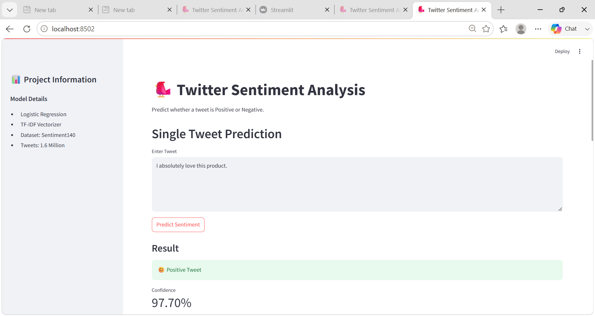
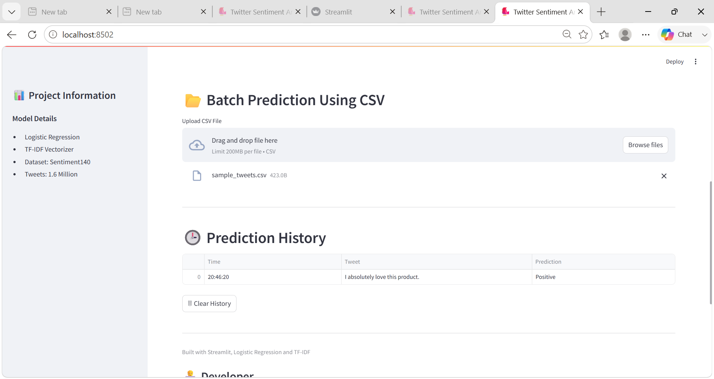
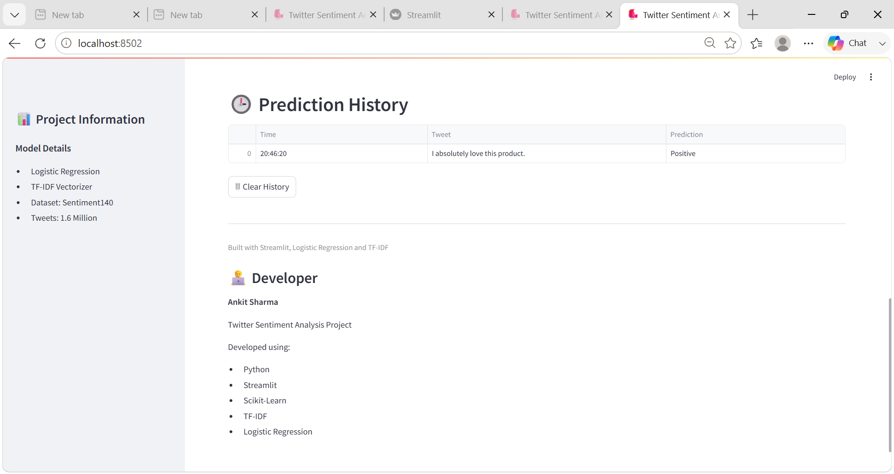

# 🐦 Twitter Sentiment Analysis App

A Machine Learning web application built using Streamlit that predicts whether a tweet is Positive 😊 or Negative 😞.

## 📌 Project Overview

This project uses the Sentiment140 dataset containing 1.6 million tweets to train a sentiment analysis model. The application allows users to analyze tweet sentiment in real-time and perform batch predictions using CSV files.

## 🚀 Features

- Single Tweet Sentiment Prediction
- Confidence Score Display
- Batch CSV Prediction
- Prediction History with Timestamp
- Download Prediction Results
- Interactive Streamlit Interface

## 🛠️ Tech Stack

- Python
- Streamlit
- Scikit-Learn
- TF-IDF Vectorizer
- Logistic Regression
- Pandas
- NLTK

## 📊 Dataset

Dataset Used: Sentiment140

- 1.6 Million Tweets
- Binary Sentiment Classification
- Positive and Negative Tweets

## 📂 Project Structure

```text
Twitter-sentiment-app/
│
├── app.py
├── trained_model.sav
├── vectorizer.sav
├── requirements.txt
└── README.md
```

## ⚙️ Installation

Clone the repository:

```bash
git clone https://github.com/YOUR_USERNAME/twitter-sentiment-analysis.git
```

Move into project folder:

```bash
cd twitter-sentiment-analysis
```

Install dependencies:

```bash
pip install -r requirements.txt
```

Run the application:

```bash
streamlit run app.py
```

## 🎯 Sample Predictions

### Positive Tweet

```text
I absolutely love this product, it works perfectly!
```

Prediction:

```text
Positive 😊
```

### Negative Tweet

```text
This is the worst service I have ever used.
```

Prediction:

```text
Negative 😞
```

## 👨‍💻 Developer

**Ankit Sharma**

Built with Streamlit, TF-IDF and Logistic Regression.

## ⭐ Future Improvements

- Deep Learning (LSTM/BERT)
- Sentiment Analytics Dashboard
- Word Cloud Visualization
- Multi-language Support
- Live Twitter/X Integration

## 📸 Application Screenshots

### Home Page



### Batch CSV Prediction



### Prediction History

